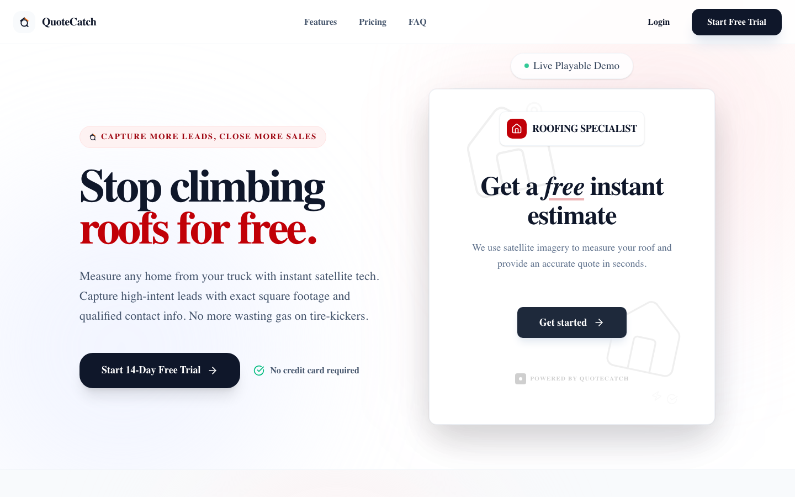
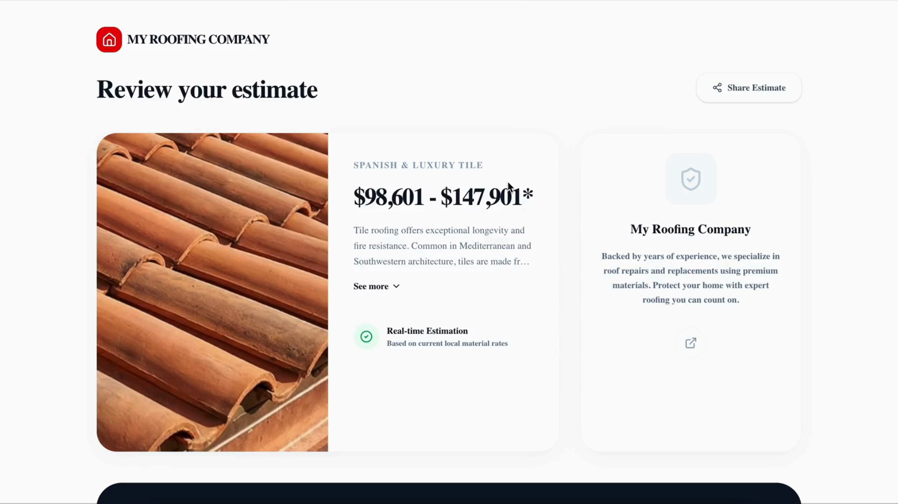

# QuoteCatch

> **Live Product**: [https://getquotecatch.com](https://getquotecatch.com)

QuoteCatch is a B2B SaaS platform that turns low-converting contractor websites into automated lead generation engines. It provides contractors with embeddable, satellite-powered instant roofing calculators that qualify prospective customers and calculate estimates in real time.

---

## 📸 Preview

<div align="center">
  
  
</div>

---

## ✨ Key Features

- **Satellite-Powered Estimator**: Interactive Mapbox and Google Maps integration allows homeowners to enter an address and receive accurate, instant roof estimates.
- **Customizable Pricing Engine**: Full contractor control over material rates, pitch multipliers, flat fees, and labor calculations with live previews.
- **Embeddable Widgets & Standalone Estimators**: Drop-in widgets for contractor websites or standalone hosted landing pages with custom branding.
- **Automated Lead Capture & Dispatch**: Captures homeowner contact details and dispatches notifications immediately to contractors.
- **SaaS Billing & Subscriptions**: Integration with Dodo Payments for monthly and yearly subscription plans with automated trials.

---

## 🛠 Tech Stack

- **Framework**: Next.js 16 (App Router, Turbopack)
- **Frontend**: React 19, TypeScript, Tailwind CSS, shadcn/ui, Framer Motion
- **Database & Auth**: Supabase (PostgreSQL, Row-Level Security, SSR Authentication)
- **Maps & Geocoding**: Mapbox GL, Google Maps JavaScript API
- **Billing**: Dodo Payments SDK
- **Deployment**: Vercel

---

## 🚀 Getting Started

### 1. Clone & Install

```bash
git clone https://github.com/labuilds/quotecatch.git
cd quotecatch
npm install
```

### 2. Environment Setup

Copy `.env.example` to `.env.local` and add your keys:

```bash
cp .env.example .env.local
```

### 3. Run Locally

```bash
npm run dev
```

Open [http://localhost:3000](http://localhost:3000) to view the application locally.

---

## 👨‍💻 Author

- **GitHub**: [@labuilds](https://github.com/labuilds)
